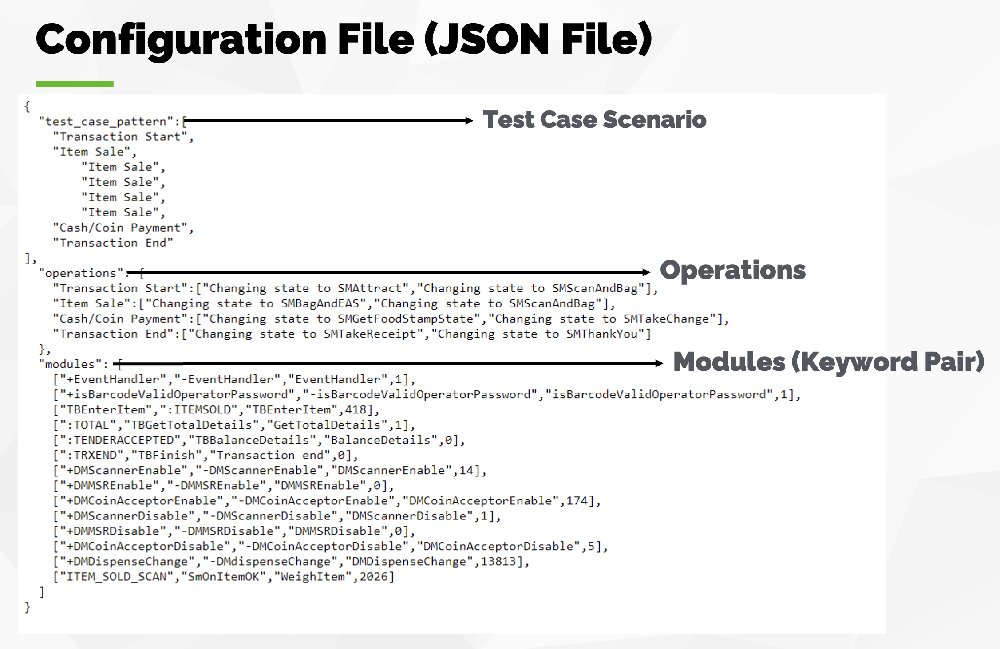
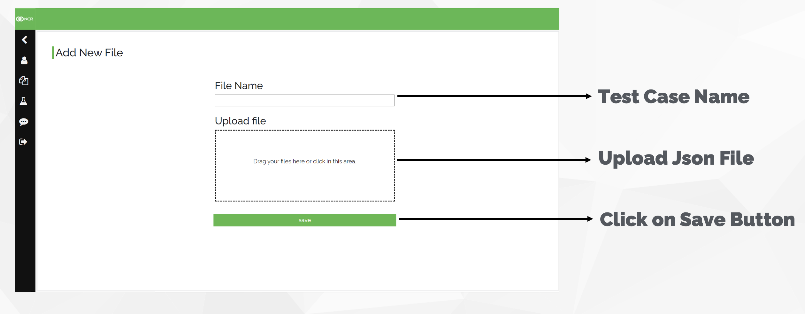
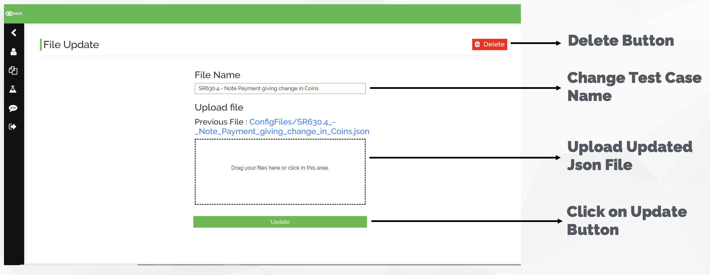
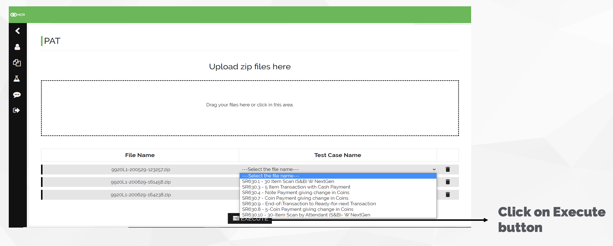
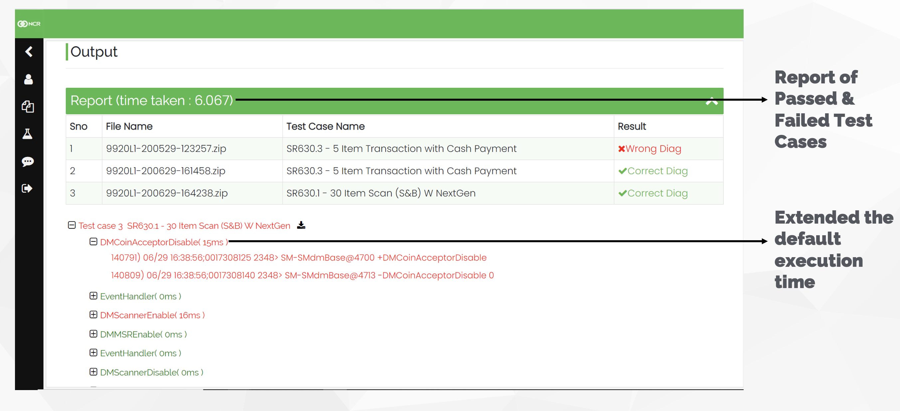
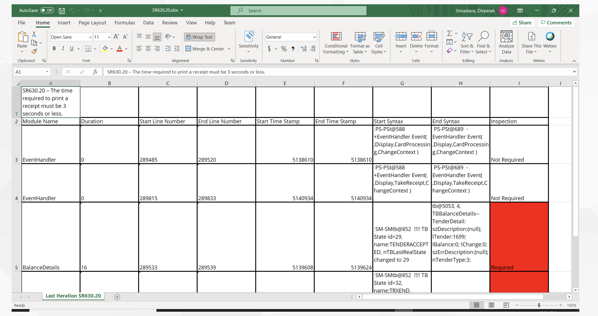

# Unconference Tallk: PAT

## Index
* What is PAT?
* Problem Statement
* Features of PAT Tool
* Technology Used
* Configuration File 
* Implementation
    * Upload Configuration File
    * Update Configuration File
    * Upload Diag Files for Analysis
* Analysis View
    * Tree View 
    * Report View
* Steps for Validation of Each Test Case
* Execution Time
* Limitations for Adding more Keyword Pairs
* Future Scope
* Demo

***

 

## What is PAT?
* Performance Analysis Tool (PAT) analyses the diag and produces the performance results.​

* Identify the areas which are bottleneck to the performance.​

* Provides detailed and easy understandable results.​

***

 

## Problem Statement
* Currently, performance analysis is done manually on SCO. It takes around 4 - 5 hours for one test case​

* When the test case fails, finding out the cause also takes a lot of time

***

 

## Solution
* PAT tool can automate this performance analysis and can also find the cause of any test case failure within seconds​

***

 

## Feature of PAT Tool
* Calculate the execution time of each standard modules. (Ex: Device Enable/Disable, TBResponse etc.)

* Provides Report of Analysis in two formats:
    * Tree Format View
    * User-friendly Report
  
* Highlights all the modules **exceeding the default time**

* Validate the test cases

* Reports **Wrong Diag** File

* **Default execution Time of modules** are easily configurable as per solution requirements

* **Test cases are easily configurable** as per solution requirements.

* **Deployment** Ready Tool

***

 

## Technology Used
* Python – Multiprocessing

* Django – Web-Framework (Back-end)

* jQuery – Front-end

* HTML & CSS – Front-end

***

 

## Configuration File (JSON Format)
* Configuration File Fields:

    * **Test Case Scenario** – Form a pattern for each test cases to validate the uploaded Diag file. Chose correct operations to form desired test case scenarios.

    * **Operations** – By default standard operations are there. If you want, you can also add customized operations according to the requirement of test case. Example :- Transaction Start : { changing state to SMAtrract, changing state to SMScanAndBag }

    * **Modules (Keyword Pairs)** – Start and end of each modules for extracting their  execution time. Customizable keyword pairs (but some limitations for tree and spreadsheet will discuss later part). Also Add Default execution time for each module if you know.

***

 

## Implementations

1. **Upload Configuration File**
   * Fill Test Case Name Field (should be unique) then upload Json File and Click on Save Button.
   
   

2. **Update Configuration File**
   * Change Name of Test Case, Upload New Json File then press Update Button, or you can also Delete that test case.
   
   
   

3. **Upload Diag Files for Analysis**
   * Select the test case uploaded from drop-down menu for validation. After selection click on execute button.
   
   

***

 

## Analysis View
* PAT Tool provides **two types of views** to users i.e., Tree View and Report view (i.e., spreadsheet view)​

* **Tree View**: Nested view. Each module contains sub-modules

* **Excel View**: Not a Nested view. This contains all modules according to your keyword pair order​.

* **Both Views contain**:
    * Line Number
    * Time Stamp
    * Whole Syntax
    * Module Name
    * Duration it took

* **Tree View for Analysis**
   

* **Report View for Analysis**
   

***

 

## Steps for Validating of Each Test Cases
* For now, SCO states considered to Validate Test Cases

* After operations are created, one can use them to create a test scenario

* Now, we have states and correct scenario that PAT will search inside the Traces.log and Traces.log.bak​ of zip file

* So, now first PAT extract the necessary details from Traces.log and Traces.log.bak and store it in a list (states) which contains​
    * Time Stamp​
    * States Name​
    * Index Number​

* Then it will start comparing with correct test scenario and once found it will extract the starting and ending index from Traces.log and Traces.log.bak.​

* Use the selected data for analysis​

***

 

## Execution Time
* **30 test case** – Less than 20 seconds.

* **1** test case – less than 3 seconds

* **2** test case – less than  3 seconds

* **Note**: From above we can see the time difference between one test case executed and two got executed is same. For each test case addition, there is only an increase of 0.2 sec​

* Now, how this is happening?

* One line answer is **Multi-processing**

* Since every test case starts at same time, execution time is reduced to a great extent.

***

 

## Limitation for Adding more Keyword Pairs
* **For Tree Format View**:
    * Keyword Pairs should be **unique**. (They should not be subset of any other keyword pairs)
    * Keywords line elements **cannot be repeated in any other keywords**.
    * One keyword’s starting should not be in **between another keyword pair** and end out of that keyword. (This also not favors tree format)
    * If there is **starting point**, then there should be **ending point** present inside the selected testcases inside Traces.log or Traces.log.bak.
  

* **For Report View (In Excel Sheet)**:
    * If there is **starting point**, then there should be ending point present inside the selected testcases inside Traces.log or Traces.log.bak.

***

 

## Future Scope
* With validation, Get a reason for Wrong diag

* Update Configuration File without uploading a JSON file.​

* Upgrade the Test Case Configuration Files.​

* Configuration Files Update Track Record.​

* Single click to download all performance results.​

* Analyzes all the performance issues also in the Diag.

***

 

# SESSION VIDEO LINK: [Performance Analysis Tool](https://drive.google.com/file/d/1hAAXq6uAfa-FkBl8V0AdsW0wWdu5xxfD/view?usp=sharing)
